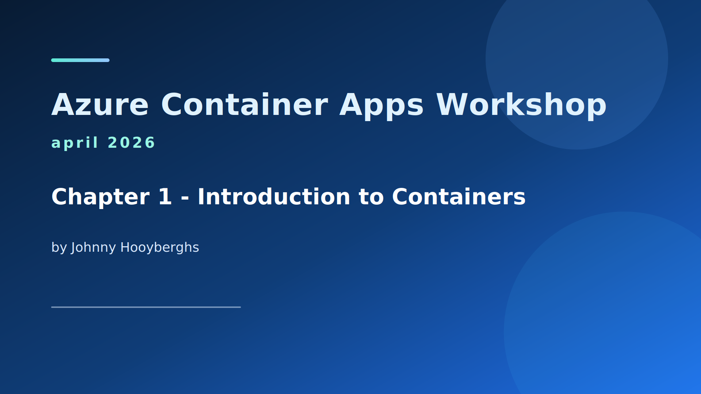
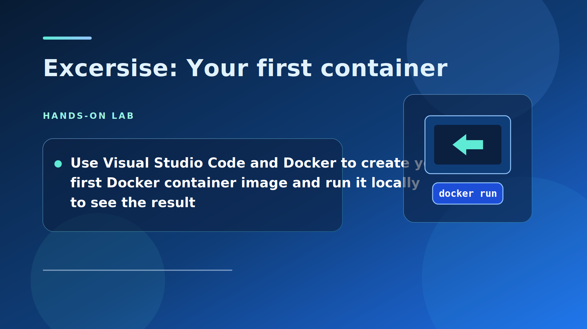
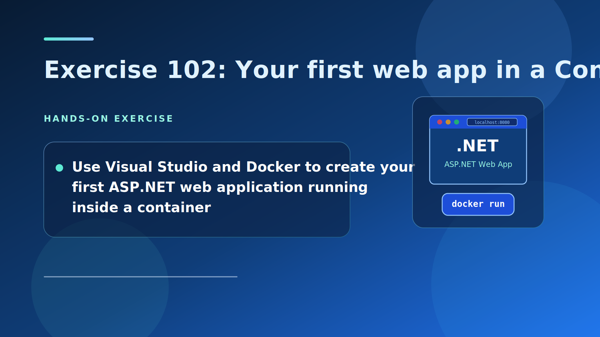
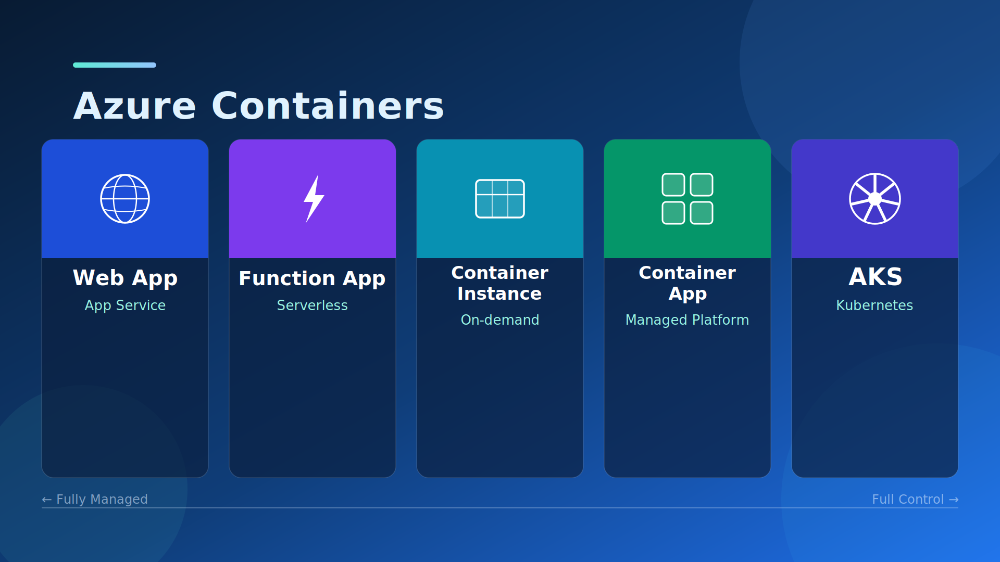

[← Back to Content](../README.md)

# Chapter 01 — Container and ACA Fundamentals

## Table of Contents

- [Slide 01 — Chapter 1: Introduction to Containers](#slide-01--chapter-1-introduction-to-containers)
- [Slide 02 — Here's Johnny](#slide-02--heres-johnny)
- [Slide 03 — Before the Container Revolution](#slide-03--before-the-container-revolution)
- [Slide 04 — The Standardized Container Era](#slide-04--the-standardized-container-era)
- [Slide 05 — Containers: Bridging Old and New](#slide-05--containers-bridging-old-and-new)
- [Slide 06 — Exercise 101: Your First Container](#slide-06--exercise-101-your-first-container)
- [Slide 07 — Exercise 102: Your First Web App in a Container](#slide-07--exercise-102-your-first-web-app-in-a-container)
- [Slide 08 — Azure Containers](#slide-08--azure-containers)

## Slide 01 — Chapter 1: Introduction to Containers

## Slide 02 — Here's Johnny

## Slide 03 — Before the Container Revolution

## Slide 04 — The Standardized Container Era

## Slide 05 — Containers: Bridging Old and New

## Slide 06 — Exercise 101: Your First Container

▶ [Go to Exercise 101](../../exercises/chapter-01/exercise-101/README.md)

## Slide 07 — Exercise 102: Your First Web App in a Container

▶ [Go to Exercise 102](../../exercises/chapter-01/exercise-102/README.md)

## Slide 08 — Azure Containers

